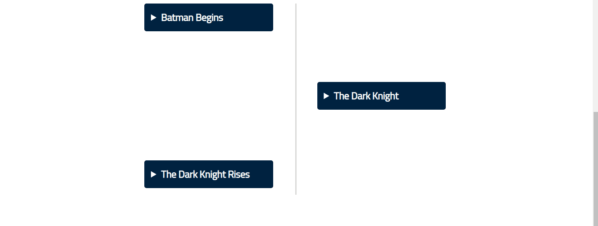
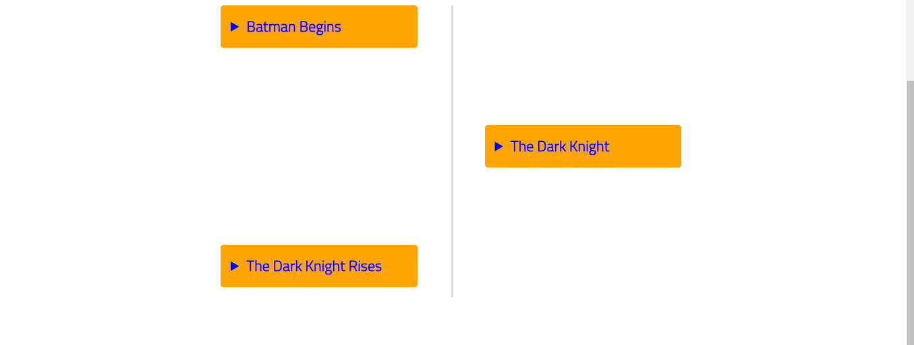
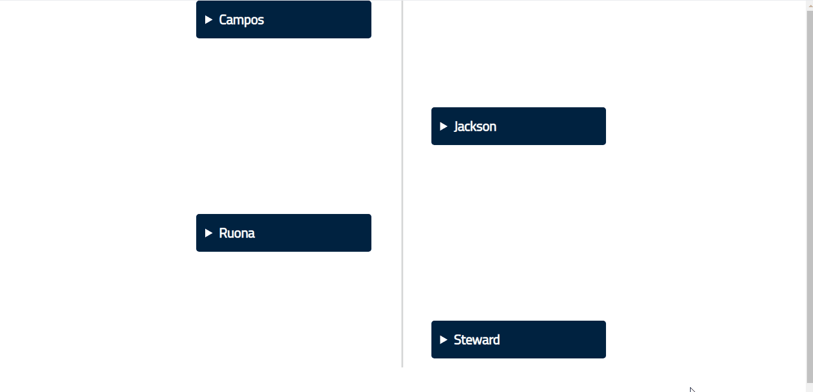
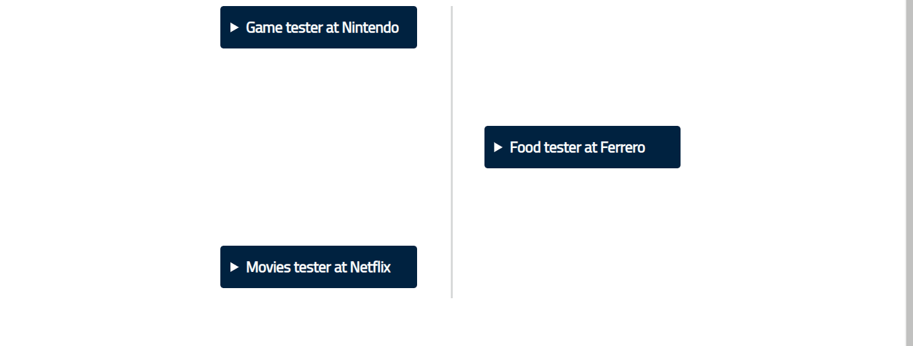

<!-- README.md is generated from README.Rmd. Please edit that file -->

```{r, include = FALSE}
knitr::opts_chunk$set(
  collapse = TRUE,
  comment = "#>",
  fig.path = "man/figures/README-",
  out.width = "100%"
)
```

# cronologia

<!-- badges: start -->
[](https://github.com/feddelegrand7/cronologia/actions)
[](https://codecov.io/gh/feddelegrand7/cronologia?branch=master)
<!-- badges: end -->

The goal of `cronologia` is to create an interactive timeline widget in RMarkdown documents and Shiny applications. 

## Installation

You can install the development version of `cronologia` from Github with:

```{r, eval=FALSE}

remotes::install_github("feddelegrand7/cronologia")

```

# Introduction

The `cronologia` package has two function: 

- `create_tml()` : used to create simple text-based timelines. 
- `create_tml_img()`: used to create timelines that include images.


# Examples 

## `create_tml()`

In order to showcase the package's features, let's create a simple data frame: 

```{r}

batman_data <- data.frame(


  date_release = c("May 31, 2005",
                   "July 14, 2008",
                   "July 16, 2012 "),

  title = c("Batman Begins",
                  "The Dark Knight",
                  "The Dark Knight Rises")
)

batman_data
```


Now, using `create_tml()`, we can create easily a timeline as follows: 


```{r, eval=FALSE}
library(cronologia)


create_tml(df = batman_data, # the data frame
           smr = "title", # the column that will be used in the summary 
           dsc = "date_release" # the column that will be used in the description
           )

```




You can easily customize the appearance of the time line using the parameters provided: 


```{r, eval=FALSE}

create_tml(df = batman_data,
           smr = "title", # summary
           dsc = "date_release", # description
           smr_col = "blue", # summary text color
           smr_bgcol = "orange", # summary background color
           dsc_col = "white", # description text color
           dsc_bgcol = "black", # description background color
           dsc_size = "30px" # description size
           )

```




### `r paste0(emo::ji("exclamation"), emo::ji("exclamation"), emo::ji("exclamation")) `

If you want to make all the summary components open by default, you can set the `open` parameter to `TRUE`. The parameter is available in all the functions.  


## `create_tml_img()`

If you want to include images within your timeline, you can use the `create_tml_img()` function. To illustrate this function, we'll use the [radous](https://github.com/feddelegrand7/radous) package that fetch the [randomuser.me](https://randomuser.me/) API and returns a data frame that contains many information (including images' URLs).

> Disclaimer: All the generated images are extracted from the authorized section of UI Faces. 


```{r, message=FALSE, warning=FALSE}
library(radous)

df <- get_data(n = 4, seed = "123")

df[c('name_last', 
     'location_street_name',
     'picture_large',
     'name_last')]

```


Now we will proceed as previously except that we need to provide two additional arguments: 

- `imgsrc`: the column that indicates the source of the images. 
- `imgalt`: the column indicating the `alt` attribute of the images. For accessibility reasons I decided to make this argument mandatory. Use a column that contains `""` if the images do not need the `alt` attribute. 

```{r, eval=FALSE}
df <- radous::get_data(4, seed = "123")

create_tml_img(df, 
               smr = "name_last", 
               dsc = "location_street_name", 
               imgsrc = "picture_large", 
               imgalt = "name_last", 
               imgwidth = "150px", 
               imgheight = "150px", 
               dsc_size = "20px")

```





## `create_tml_2()`

Following the idea of [Tobias](https://twitter.com/toeb18/status/1355104693299634181?s=20) for creating an interactive CV I thought that two (2) description components would be more appropriate. The function is similar to `create_tml()` except that it adds another description paragraph to the Timeline. 

Let's go through an example: 


```{r}
cv <- data.frame(
  
  
  jobs = c("Game tester at Nintendo", "Food tester at Ferrero", "Movies tester at Netflix"), 
  
  period = c("2020-2022", "2022-2024", "2026-2030"),
  
  todos = c("Playing Zelda all day", "Eating Bueno all day", "Watching the Office all day")
  
)


cv
```

```{r, eval=FALSE}

create_tml_2(cv, 
             smr = "jobs", 
             dsc = "period", 
             dsc2 = "todos", 
             dsc2_col = "white",
             dsc2_bgcol = "peru") # yes, peru is also a color

```




# TODOS 

- [x] Writing unit tests 
- [ ] Creating a hex sticker 
- [x] Sharing with RWeekly
- [ ] Talk about it at a virtual event


# Code of Conduct

Please note that the `cronologia` project is released with a [Contributor Code of Conduct](https://contributor-covenant.org/version/2/0/CODE_OF_CONDUCT.html). By contributing to this project, you agree to abide by its terms.
