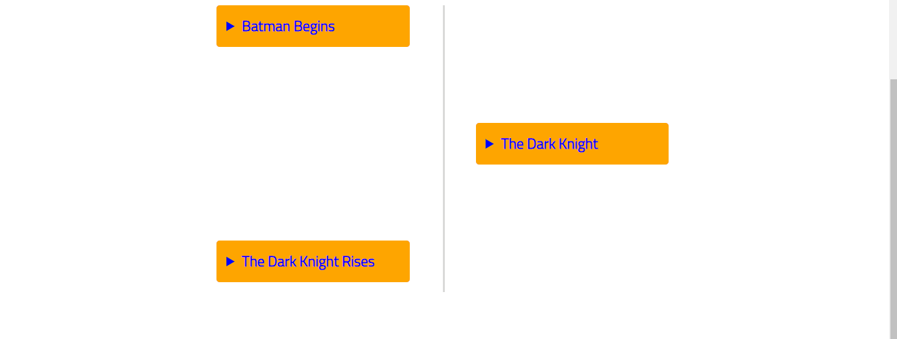

<!-- README.md is generated from README.Rmd. Please edit that file -->

# cronologia

<!-- badges: start -->
<!-- badges: end -->

The goal of `cronologia` is to create an interactive timeline widget in
RMarkdown documents and Shiny applications.

## Installation

You can install the development version of `cronologia` from Github
with:

``` r
remotes::install_github("feddelegrand7/cronologia")
```

# Introduction

The `cronologia` package has two function:

-   `create_tml()` : used to create simple text-based time lines.
-   `create_tml_img()`: used to create time lines that include images.

# Examples

## `create_tml()`

In order to showcase the package’s features, let’s create a simple data
frame:

``` r
batman_data <- data.frame(


  date_release = c("May 31, 2005",
                   "July 14, 2008",
                   "July 16, 2012 "),

  title = c("Batman Begins",
                  "The Dark Knight",
                  "The Dark Knight Rises")
)

batman_data
#>     date_release                 title
#> 1   May 31, 2005         Batman Begins
#> 2  July 14, 2008       The Dark Knight
#> 3 July 16, 2012  The Dark Knight Rises
```

Now, using `create_tml()`, we can create easily a timeline as follows:

``` r
library(cronologia)


create_tml(df = batman_data, # the data frame
           smr = "title", # the column that will be used in the summary 
           dsc = "date_release" # the column that will be used in the description
           )
```


You can easily customize the appearance of the time line using the
parameters provided:

``` r
library(cronologia)


create_tml(df = batman_data,
           smr = "title", # summary
           dsc = "date_release", # description
           smr_col = "blue", # summary text color
           smr_bgcol = "orange", # summary background color
           dsc_col = "white", # description text color
           dsc_bgcol = "black", # description background color
           dsc_size = "30px" # description size
           )
```



## `create_tml_img()`

If you want to include images within your timeline, you can use the
`create_tml_img()` function. To illustrate this function, we’ll use the
[radous](https://github.com/feddelegrand7/radous) package that fetch the
[randomuser.me](https://randomuser.me/) API returns and returns a data
frame that contains many information (including images’ URLs).

> Disclaimer: All the generated images are extracted from the authorized
> section of UI Faces.

``` r
library(radous)

df <- get_data(n = 4, seed = "123")

df[c('name_last', 
     'location_street_name',
     'picture_large',
     'name_last')]
#> # A tibble: 4 x 4
#>   name_last location_street_na~ picture_large                          name_last
#>   <chr>     <chr>               <chr>                                  <chr>    
#> 1 Campos    Rua Três            https://randomuser.me/api/portraits/m~ Campos   
#> 2 Jackson   Armagh Street       https://randomuser.me/api/portraits/w~ Jackson  
#> 3 Ruona     Hämeentie           https://randomuser.me/api/portraits/w~ Ruona    
#> 4 Steward   Henry Street        https://randomuser.me/api/portraits/w~ Steward
```

Now we will proceed as previously except that we need to provide two
additional arguments:

-   `imgsrc`: the column that indicates the source of the images.
-   `imgalt`: the column indicating the `alt` attribute of the images.
    For accessibility reasons I decided to make this argument mandatory.
    Use a column that contains `""` if the images do not need the `alt`
    attribute.

``` r
df <- radous::get_data(4, seed = "123")

create_tml_img(df, 
               smr = "name_last", 
               dsc = "location_street_name", 
               imgsrc = "picture_large", 
               imgalt = "name_last", 
               imgwidth = "150px", 
               imgheight = "150px", 
               dsc_size = "20px")
```


# TODOS

-   Writing unit tests
-   Creating a hex sticker

# Code of Conduct

Please note that the `cronologia` project is released with a
[Contributor Code of
Conduct](https://contributor-covenant.org/version/2/0/CODE_OF_CONDUCT.html).
By contributing to this project, you agree to abide by its terms.
